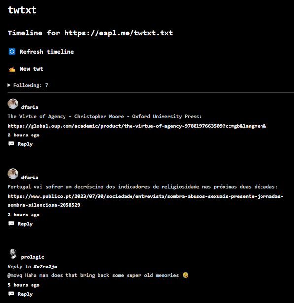

# phpub2twtxt - twtxt-php

Forked from phpup2twt

Will be renamed to `twtxt-php` and moved to a new repo soon

A PHP web interface to publish your microblogging in twtxt format [twtxt.txt](https://github.com/buckket/twtxt)

Tested with PHP 7.3.33

By [@eapl.me](https://eapl.me/twtxt/)

## Goals
* Make it extremely easy to self-host a twtxt Web interface on a VPS or PHP shared-server
* Offer a personal Web instance to write new twts, read your timeline, follow people and reply.
  One instance for each twtxt account/file (or perhaps multi-account in the future)
* Compatible with Gemtext, and perhaps in the future with Gemini servers. (Station alike)

## twtxt Specification and Extensions
[twtxt file spec](docs/01-twtxtfile.md)

[Metadata extension](docs/02-metadata-extension.md)

[Hash extension](docs/03-hash-extension.md)

[Extension references](docs/00-twtxt_extensions_refs.md)

## Setup
TBD

[README.md from original phpup2twt](README_old.md)

## Development To Do
[TODO.md](TODO.md)
